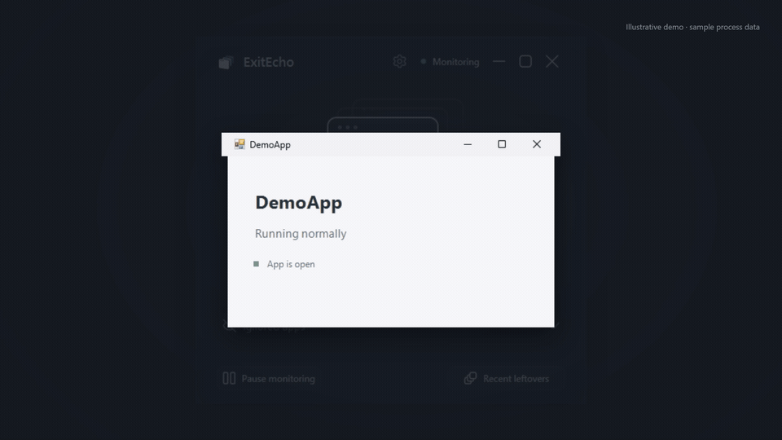
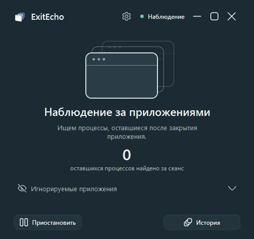
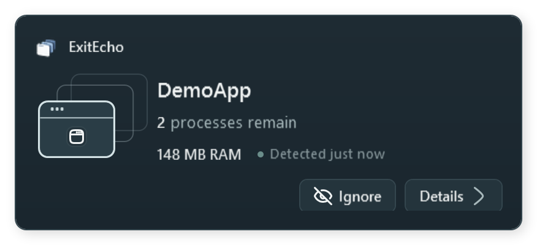
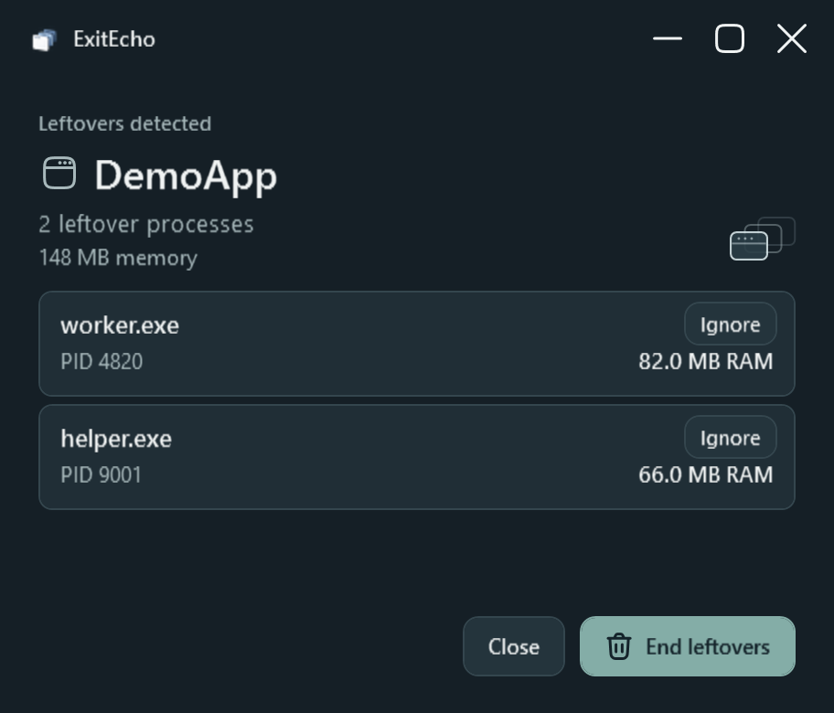
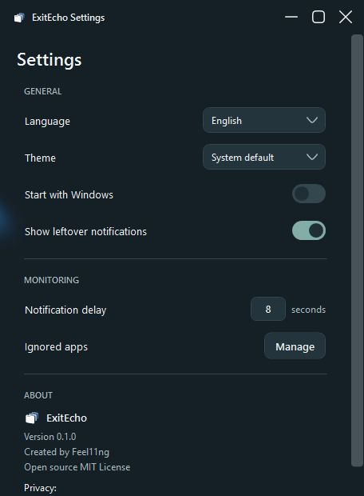
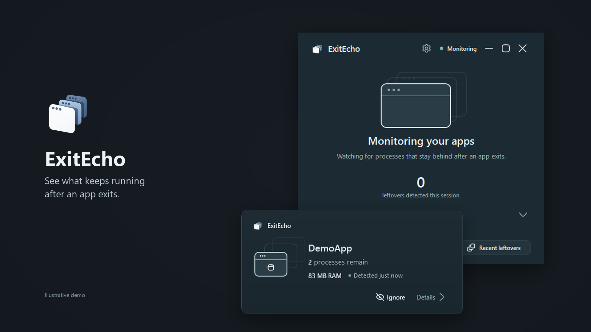

# ExitEcho

**See what keeps running after an app exits.**

ExitEcho watches Windows apps with visible windows and reports related processes that remain after those windows close. You can inspect the processes before deciding whether to ignore or end them.



**Windows 10/11 x64** · [Download v0.3.0](https://github.com/Feel11ng/ExitEcho/releases/tag/v0.3.0)

## Code signing policy

ExitEcho is preparing an application to SignPath Foundation. Current releases are **not signed**. See the [code signing policy](docs/CODE_SIGNING.md) for the proposed signing process, project roles, privacy policy, and release approval requirements.

## What it does

- Watches apps you open normally and waits after their last visible window closes before reporting leftovers.
- Shows each remaining process's name, PID, and RAM. **End leftovers** is manual and requires confirmation.
- Keeps a local exit history. **Ignore app** suppresses alerts for an entire app; **Ignore process** excludes one process for that app while leaving other processes visible.
- Runs in the tray with pause and resume controls and a single GUI instance.
- Supports light and dark themes and 27 UI languages. Settings cover theme, language (or the Windows default), optional startup, notifications, and detection delay.

## Screenshots

| Main window | Notification |
| --- | --- |
|  |  |
| Details | Settings |
|  |  |

[](assets/demo.mp4)

The demo shows real ExitEcho windows with illustrative process data.

## Install and use

Download [ExitEcho-v0.3.0-win-x64.zip](https://github.com/Feel11ng/ExitEcho/releases/download/v0.3.0/ExitEcho-v0.3.0-win-x64.zip), extract it, and run `ExitEcho.exe`. No installer or administrator rights are needed.

ExitEcho starts in the tray and monitors in the background. Open it from the tray icon. A notification leads to **Details**, where you can inspect processes, ignore one process, or end the listed leftovers after confirmation. Use **Ignore** on the notification to ignore the whole app. Manage both kinds of rules under Ignored apps. You can pause monitoring from the tray or main window. The default notification delay is eight seconds; Settings allows 3–60 seconds.

## Uninstall the portable app

1. Exit ExitEcho from its tray icon. If you enabled **Start with Windows**, turn it off in Settings first; this removes ExitEcho's per-user startup entry.
2. Delete the folder where you extracted `ExitEcho.exe`. There is no installer to run.
3. If you also want to remove your local settings, exit history, and ignored-app rules, delete `%LOCALAPPDATA%\ExitEcho`. Leave this folder in place if you want to keep that data.

If the app has already been deleted while **Start with Windows** was enabled, remove only the `ExitEcho` value from `HKEY_CURRENT_USER\Software\Microsoft\Windows\CurrentVersion\Run` (for example, with `reg delete "HKCU\Software\Microsoft\Windows\CurrentVersion\Run" /v ExitEcho /f`).

## CLI and building

The CLI is built separately from source and remains in English:

```text
exitecho watch
exitecho run "<path-to-exe>" [args]
```

Build on Windows 10/11 x64 with the .NET 10 SDK:

```powershell
dotnet restore ExitEcho.sln
dotnet build ExitEcho.sln -c Release -p:PlatformTarget=x64
dotnet publish ExitEcho.App/ExitEcho.App.csproj -c Release -r win-x64 --self-contained true -p:PublishSingleFile=true -p:PlatformTarget=x64
```

The desktop UI checks require an interactive Windows session and run locally with
`dotnet run --project tests/ExitEchoIgnoreUiHost/ExitEchoIgnoreUiHost.csproj -c Debug`.

## Privacy

All settings and history stay local. No account, telemetry, or network requests. See the [privacy policy](docs/CODE_SIGNING.md#privacy-policy) for details.

## Limitations

ExitEcho observes apps with visible top-level windows, so it may miss inaccessible, short-lived, or detached processes. It cannot tell whether background activity is intentional; some apps continue running by design. It never ends processes automatically. Process ignore rules use the app's EXE path when available. A rule based only on the app name is less precise and is labeled in the UI.

See the [changelog](CHANGELOG.md), [third-party notices](THIRD_PARTY_NOTICES.md), and [MIT license](LICENSE). Created by **Feel11ng**.
